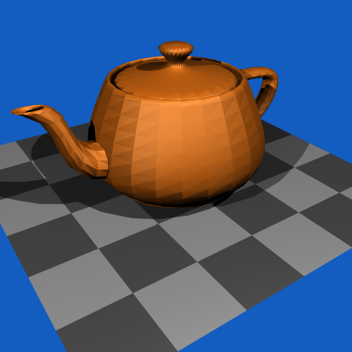
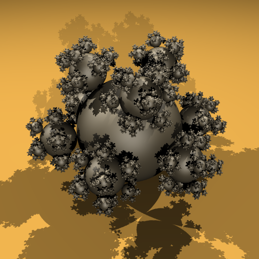
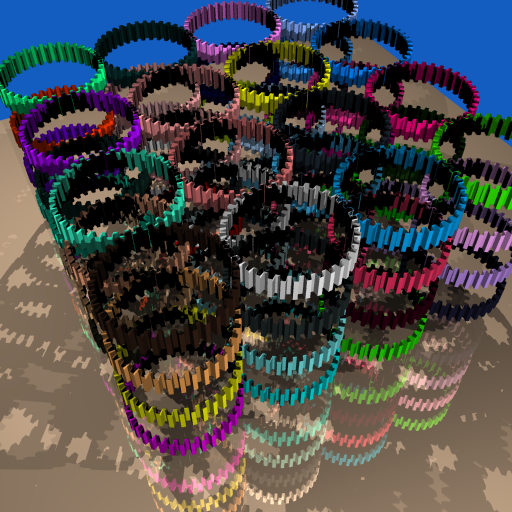
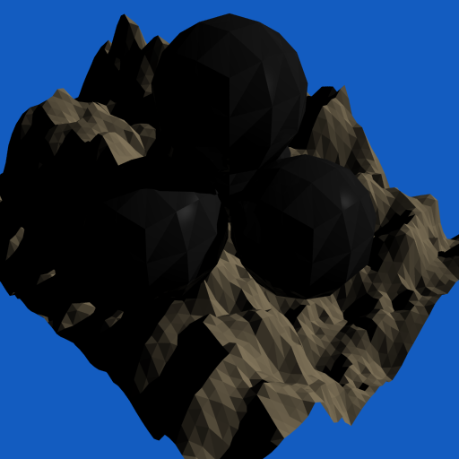
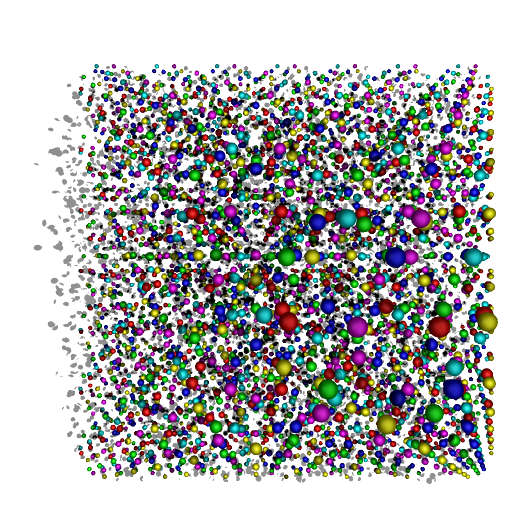

# Simple NFF Renderer 

## Introduction
-------
    This is a simple renderer for nff files that support:
    - shadows
    - phong shading model
    - multithreading with tbb
    - acceleration using BVH
    - reflection (in progress)
    - refraction (in progress)
    
## Requirements
--------
    This program requires:
    - tbb(Intel Threading Building Blocks)
    - make

## Installation
---

clone the repository and cd into the folder, and type:
```
$ make
```
To clean up, simply type
```
$ make clean
```
To run the program:
```
$ ./trace [input.nff] [output.ppm]
```


## Demonstration
- Rendering a teapot using ``256`` sample rays. 
  
- Rendering some number of balls using ``16`` sample rays.

- Rendering some gears using ``64`` sample rays.

- Rendering a simple mountain using ``256`` sample rays.

- Rendering some rings using ``64`` sample rays.

