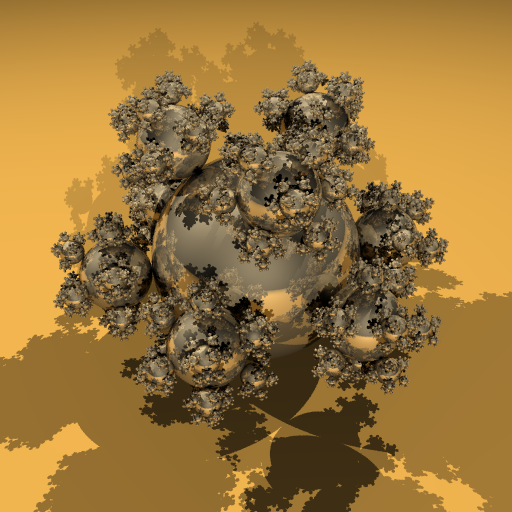

# Simple NFF Renderer 

    This is a simple renderer for nff files that support:
    - :heavy_check_mark: shadows
    - :heavy_check_mark: raytracing
    - :heavy_check_mark: multithreading with tbb
    - :hammer: reflection (in progress)
    - :hammer: refraction (in progress)
    - :hammer: acceleration using BVH (in progress)

## Some demonstration photo so far (without the in progress functionality)

