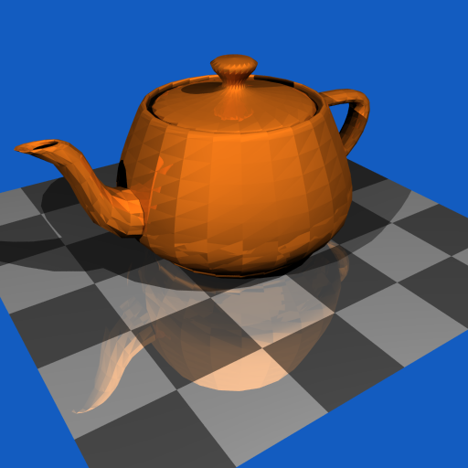

# Simple NFF Renderer 

    This is a simple renderer for nff files that support:
    - shadows
    - phong shading model
    - multithreading with tbb
    - reflection (in progress)
    - refraction (in progress)
    - acceleration using BVH (in progress)
    

## Some demonstration photo so far (without the in progress functionality)
- The folowing results uses sample = 16 for now

